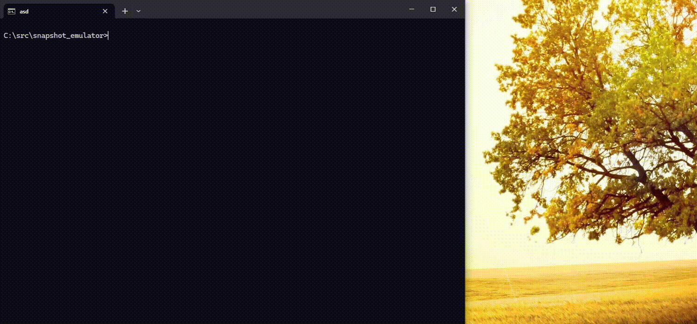
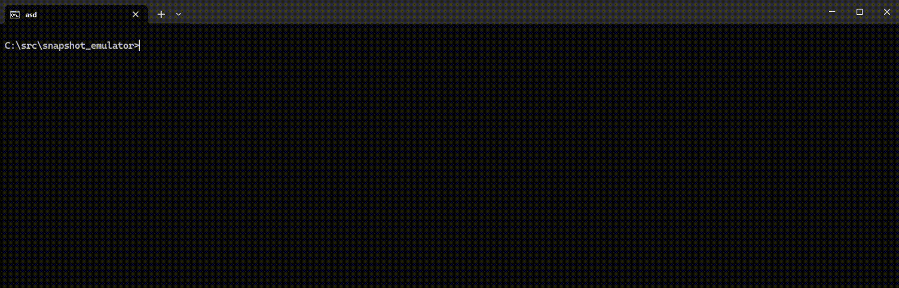
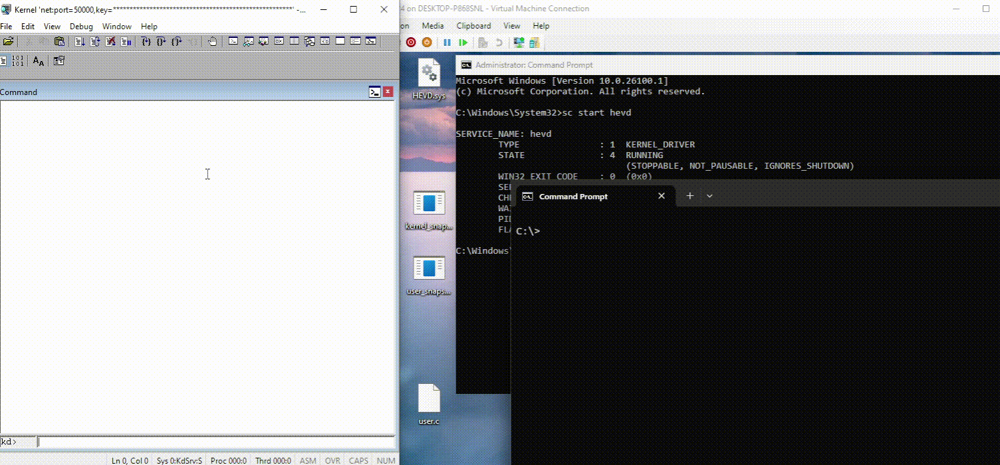
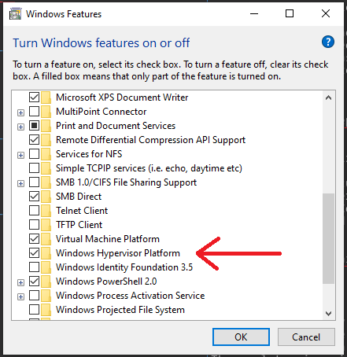

## Overview

_SNAFUzz_ is a snapshot-based fuzzer designed to attack Windows kernel- or userspace-components.
The system loosely consists of four components:
- A custom hypervisor capable of booting Windows 11.
- A deterministic full system emulator designed for snapshot fuzzing.
- A builtin WinDbg-Style Debugger used to create snapshots and root-cause crashes.
- A framework for implementing target-specific input injection code.

Snapshots can be produced by booting Windows 11 in the hypervisor, breaking in the builtin debugger and then using the `snapshot` debugger command.
Alternatively, (specialized) [Kernel Memory Dumps](https://learn.microsoft.com/en-us/windows-hardware/drivers/debugger/complete-memory-dump) can be used as snapshots. 
These can be relatively easily created by using WinDbg as a kernel debugger. 
The snapshots are then loaded into the emulator. The emulator is a "full" system x64-emulator, based on a JIT engine. 
The JIT engine can be relatively simple, as we assume that both the host and the target are running x64 and we only JIT-compile one instruction at a time.
The emulator is designed with the explicit goal of providing a good environment for fuzzing.

As the emulator is deterministic, any bug can be 100% accurately reproduced and root-caused in the builtin debugger. 
The emulator also implements instruction-, branch- and compare-coverage, 
as well as additional memory protections to catch off-by-one heap accesses, use-after-frees and double-frees.
Because we emulate one instance of Windows per thread, execution speed scales almost linearly with cores and the system is designed to very quickly reset back to the snapshot.

Versions of this tool have found multiple bugs including 
[CVE-2021-43247](https://msrc.microsoft.com/update-guide/vulnerability/CVE-2021-43247), 
[CVE-2023-23417](https://msrc.microsoft.com/update-guide/vulnerability/CVE-2023-23417), 
[CVE-2023-33154](https://msrc.microsoft.com/update-guide/vulnerability/CVE-2023-33154), 
[CVE-2024-38127](https://msrc.microsoft.com/update-guide/vulnerability/CVE-2024-38127),
[CVE-2025-32715](https://msrc.microsoft.com/update-guide/vulnerability/CVE-2025-32715),
[CVE-2025-49661](https://msrc.microsoft.com/update-guide/vulnerability/CVE-2025-49661), 
[CVE-2025-49730](https://msrc.microsoft.com/update-guide/vulnerability/CVE-2025-49730),
another privilege escalation vulnerability in a popular 3rd-party driver, and a remote code execution vulnerability in a pre-release version of the Microsoft RDP-Client.

## Snapshot Mode <a name="section-snapshot-mode"></a>

Two different modes are implemented, a _Snapshot Mode_ and the _Fuzzing Mode_. Snapshot Mode uses the hypervisor and we emulate a framebuffer, a disk, a mouse and, a keyboard
to essentially provide the interface you would expect from a virtual machine. All writes to the disk will be temporary and will not be applied to the virtual disk.
To boot from a virtual disk (.vhdx or .qcow2) simply use: `snafuzz.exe <disk-file>`.
Once booted, you can take a snapshot by using `CTRL-C` inside the command prompt to break in the debugger and use the `snapshot` command.
The `.snapshot`-file can then also be used to reload the system using it as the argument: `snafuzz.exe <.snapshot-file>`.

<p align='center'>

</p>

When creating a snapshot for the purpose of fuzzing, it is usually necessary to get the system into a specific state, where the target-specific code knows what to do. 
In the following example, we first patch `CI!g_CiOptions` to allow us to load the unsigned driver `HEVD.sys` and then trigger a breakpoint at 
`nt!NtSetInformationTransactionManager` using the `kernel_snapshot.exe` utility. This sets us up to fuzz `HEVD.sys` using the `default_target.c`.

<p align='center'>

</p>

### Supported Versions of Windows

Because the hypervisor uses a very incomplete implementation of UEFI ([`uefi_bios.c`](src/uefi_bios.c)), not all version of Windows boot.
The main target is the [latest canary build of Windows 11](https://learn.microsoft.com/en-us/windows-insider/flight-hub/).
Download the ISO, create a new Hyper-V virtual machine, disable "Checkpoints" (or merge the .avhdx after installing), install Windows 11 from the ISO, 
then you can use the resulting .vhdx to boot in Snapshot Mode.
Installing and updating Windows 11 [requires](https://learn.microsoft.com/en-us/windows/whats-new/windows-11-requirements) 
a Gen 2 VM with TPM enabled, at least 4 GiB Ram, at least 64 GB of disk space and at least 2 virtual cores.

## Fuzzing and target-specific code

The command-line for `snafuzz.exe` is split into two parts:
```
snafuzz.exe <snapshot-options> -- <target-specific-code options>
```
If the `--` is specified we are in fuzzing mode and all options after it are passed to the target-specific code. 
The default "target-specific" code ([`default_target.c`](src/default_target.c)) has two modes
```
C:\projects\snafuzz>snafuzz.exe snap.snapshot --
...
Default target usages:
    kernel_snapshot: <\Device\DeviceName> [ioctl...]
    user_snapshot: -buffer <input_buffer> -size <input_size> [-corpus <directory>]
```
Which correspond to the two snapshotting-utilities [`kernel_snapshot.c`](kernel_snapshot.c) and [`user_snapshot.c`](user_snapshot.c).

The `kernel_snapshot.c` will allocate some memory, set the priority class to real time and then call into `nt!NtSetInformationTransactionManager`.
The `default_target.c` opens a handle to `<\Device\DeviceName>` by emulating a call to `nt!NtCreateFile` and then, during fuzzing, emulates calls
to `nt!NtDeviceIoControlFile` using the allocated memory as `input_buffer` and `output_buffer`.

The `user_snapshot.c` allows creating snapshots of a usermode program: 
```
user_snapshot.exe <breakpoint offset> -- <target command line>
```
It is a small "debugger" which sets a software-breakpoint on the target address and once hit (the hypervisor ignores software breakpoints), 
it locks all the entire address space, sets the priority class to real time and finally sets a hardware breakpoint on the target address.
The hardware breakpoint will cause the hypervisor to break in the builtin debugger, allowing us to take a snapshot.

If the target crashes a _.crash_-file will be saved in the `crashes` folder.
If the target returns from `nt!NtDeviceIoControlFile` (or the function at rip in `user_snapshot.c`) the next call to it is generated. 
After `FUZZ_CASES_BEFORE_RESET` calls or after `FUZZ_CASE_TIMEOUT` instructions (based on `options.c`) the target is reset to the snapshot.
Inputs are based on a simple mutator (`apply_simple_mutations`) and coverage feedback.

<p align='center'>

</p>

For more complex targets you can specify target-specific code when building (also see the [Build](#Build) section). 
An example for fuzzing a kernel mode module is [`hevd.c`](hevd.c) and an example for fuzzing a user-space application is [`HeaderParser.c`](HeaderParser.c).
Both of these target files also contain a big comment, that tutorializes using them.

A target file allows you to run setup code and allows for target-specific mutation and execution code, 
by requiring you to implement the following functions:

* `target_initialize`
* `target_get_input`
* `target_execute_input`

For a more documentation on how to write target-specific code see `target_specific_code_api.h`.

## Using .DMP-files as Snapshots

To allow fuzzing snapshots taken from physical machines, as well as version of Windows which fail to boot in the hypervisor, 
full kernel .DMP-files can also be used as snapshot files. These can be produced by using [KDNET](https://learn.microsoft.com/en-us/windows-hardware/drivers/debugger/setting-up-a-network-debugging-connection-automatically)
to attach WinDbg to the target machine and then using `.dump /f C:\path\to\dump.dmp` command. To start fuzzing the .DMP-file is then passed as an argument: `snafuzz.exe C:\path\to\dump.dmp -- <fuzzing-options>`.
Here is an example of using the `default_target.c` to fuzz [HEVD.sys](https://github.com/hacksysteam/HackSysExtremeVulnerableDriver).

<p align='center'>

</p>

If the target machine is a virtual machine, one can also provide the virtual disk as an argument, allowing for disk-emulation during fuzzing: `snafuzz.exe C:\path\to\dump.dmp C:\path\to\disk.vhdx -- <fuzzing-options>`.
For virtual machines, it is also important to make sure _Dynamic Memory_ is disabled as otherwise WinDbg fails to create the full kernel dump with the error: "Unable to read MmPhysicalMemoryBlock"
and (when passing the .vhdx) it is important to disable "Checkpoints", as the system currently only supports normal .vhdx and not .avhdx.

It is possible to convert .DMP-files into .snapshot-files (which load a lot faster) by using the `-convert <.snapshot>` option, or alternatively using `-d` to start in the debugger and then use the `snapshot` debugger command.

If you have trouble creating a working .DMP-file, you can also try any of the applicable options:

* **Disable Dynamic Memory** (Virtual Machine Only)  
  This option is inside the options menu of the virtual machine, or in the memory options when creating the VM.
  If dynamic memory is enabled WinDbg fails to create full kernel dump files, with the error:
  "Unable to read MmPhysicalMemoryBlock"
  
* **Disable VBS**
  Virtualization Based Security is a Windows feature, where the kernel runs inside a thin virtual machine
  (the securekernel.exe). This means that while creating the DMP-file WinDbg cannot see the pages
  belonging the secure kernel. Furthermore, during execution, the guest will then try to call into the 
  secure kernel which we cannot emulate, as the pages are not in the .DMP-file.
  It seems this option is disabled by default. You can check if it is enabled using the "System Information". 
  If it is, you can disable it using the following commands from an administrator command prompt (and then restart):
  
```
bcdedit /set hypervisorlaunchtype off
reg add "HKLM\SYSTEM\CurrentControlSet\Control\DeviceGuard" /v "EnableVirtualizationBasedSecurity" /t REG_DWORD /d 0 /f
```
  
<!---
  To disable VBS you can use 
reg add "HKLM\SYSTEM\CurrentControlSet\Control\DeviceGuard" /v "EnableVirtualizationBasedSecurity" /t REG_DWORD /d 0 /f
reg add "HKLM\SYSTEM\CurrentControlSet\Control\DeviceGuard" /v "RequirePlatformSecurityFeatures" /t REG_DWORD /d 0 /f
reg add "HKLM\SYSTEM\CurrentControlSet\Control\DeviceGuard" /v "Locked" /t REG_DWORD /d 0 /f
reg add "HKLM\SYSTEM\CurrentControlSet\Control\DeviceGuard\Scenarios\HypervisorEnforcedCodeIntegrity" /v "Enabled" /t REG_DWORD /d 0 /f
reg add "HKLM\SYSTEM\CurrentControlSet\Control\DeviceGuard\Scenarios\HypervisorEnforcedCodeIntegrity" /v "Locked" /t REG_DWORD /d 0 /f
```
-->

* **Disabling the pagefile**  
  Disabling the pagefile will prevent Windows from paging out dirty pages to disk. 
  The less that is paged out the more relevant memory is contained in the DMP.
  
* **Set the `DisablePagingExecutive` registry key**  
  This option prevents the kernel from paging out parts of kernel modules. This registry key can be set using `wpr -disablepagingexecutive On`.

## Using .crash-files

After you have found crash, a .crash-file is saved in the `crashes` folder. These crashes can be reproduced using the `-r` option.
This can be combined using the `-d`  option to start in the debugger and root-cause the issue.
Furthermore, a .crash-file can be _minimized_ using the `-m` option. Usually, .crash-files contain multiple inputs (e.g. calls to `nt!NtDeviceIoControlFile`).
The `-m` option attempts to delete inputs by omitting them while reproducing the issue. If the bug still reproduces in the same way, after 
omitting an input, we can safely remove it from the .crash-file.

<p align='center'>

</p>

## Coverage visualization

Periodically during fuzzing (or when using `write_coverage_files` in the builtin debugger), coverage files are written to the `coverage` folder.
These are simple text files containing a list of all module-offsets hit during execution. 
The Ghidra script [`ColorHitInstructions.java`](scripts/ColorHitInstructions.java) can be used to color all hit instructions gray.
The script is based of [this](https://github.com/alephsecurity/general-research-tools/tree/master/ghidra_scripts/ColorInstructions) repository.

<p align='center'>

</p>

## Build

Currently, the only supported platform is Windows and the only supported compiler is MSVC.

SNAFUzz has been tested to work both on an intel CPU (Core i7-9850H and Core i7-1365U) and on an AMD cpu (AMD Ryzen 7 2700), on Windows 11 and Windows 10 respectively 
and can boot both Window 11 Professional and Home editions. But there are likely some CPU's / editions of Windows that do not work at this time.

The build _should be_ as simple as using `build.bat` from an "x64 Native Tools Command Prompt" in the root directory of the project.
Optionally, you can specify target-specific code in the form of a `target.c` file as the argument to `build.bat` (e.g `build.bat hevd.c`).
The project is using a single compilation unit style build and therefore the `target.c` file is simply
included into `main.c` at a point where it can see all relevant functions. Hence, the `target.c` does not have to include any header files.
If no `target.c` is specified, the `default_target.c` is used instead.

Configuration (e.g. `FUZZ_CASES_BEFORE_RESET`, `FUZZ_CASE_TIMEOUT`, ...) is done using the `options.c` file.

Sometimes, to run the hypervisor the "Windows Hypervisor Platform" optional Windows feature to be enabled.

<p align='center'>

</p>

### Linux

Technically, there is a linux build (`build.sh`), but it is less tested and possibly unmaintained. On linux, the hypervisor uses the KVM API's instead of the Windows Hypervisor Platform API's.
These work quite a bit differently and using SNAFUzz this way is way less tested. The JIT-based emulator backend should work more or less equivalently on linux,
though there are also some internal differences.

SNAFUzz on linux has only ever been tested inside the Windows Subsystem for Linux (WSL) using the [`nestedVirtualization`](https://learn.microsoft.com/en-us/windows/wsl/wsl-config#main-wsl-settings) option.

Too build SNAFUzz on linux, first install the dependencies (x11 is needed for the hypervisor, curl for downloading .pdb's from the Microsoft symbol server):
```
sudo apt install clang lld libx11-dev libcurl4-openssl-dev
```
and then run `./build.sh`.

Running the builtin hypervisor needs access to the KVM API's which are restricted to the kvm group.

## Internals

The hypervisor ([`hyperv.c`](src/hyperv.c)/[`kvm.c`](src/kvm.c)) is implemented using the [Windows Hypervisor Platform APIs](https://learn.microsoft.com/en-us/virtualization/api/hypervisor-platform/hypervisor-platform).
Devices are based on a custom implementation of the VMBUS ([`vmbus.c`](src/vmbus.c)) and consist of a framebuffer, an SCSI-disk, a PS/2-keyboard and an absolutely positioned HID-mouse.

Guest physical memory ([`memory_unit.c`](src/memory_unit.c)) is simply virtual memory on the host. Each thread has its own copy of the physical memory, which gets copied in on first access and is reset by remembering dirty pages.
Guest virtual memory translations are cached in a TLB (Translation Lookaside Buffer). Extra-permission pages are looked up in a parallel page-table and are also cached in the TLB.
The TLB is also used inside the JIT (Just-In-Time compiler) to speed up memory-lookups. 

The JIT ([`jit.c`](src/jit.c)) lifts basic blocks of guest instructions, changing each one to translate guest virtual memory and use a register struct instead of the host registers. 
No optimizations between instructions are implemented. Essentially, an instruction like `mov rcx, qword [rdx]` becomes:
```asm
"mov rcx, qword [rdx]":
    mov r8, [registers + .rdx]           ; Load the guest register into r8.
    call translate_guest_virtual_address ; Get the corresponding host address for the access.
                                         ; This function will return out from the jit on failure.
    mov rax, [rax]                       ; Perform the memory access.
    mov [registers + .rcx], rax          ; Write the resulting value into the guest registers.
```
Lifted blocks are cached based on the physical page they start and end on and block lookup is speed-up by an instruction cache.
Calls to lifted blocks are "chained", by letting each block remember what they jumped to last time and check inside the JIT,
whether they want to jump to the same address again. On a crash or timeout, the JIT simply sets `context->crash` and returns out.

Coverage information ([`coverage.c`](src/coverage.c)) is collected while jitting instructions and compare- and branch-coverage work by emitting a special function calls before comparison- and conditional jump-instructions.

The debugger ([`debugger.c`](src/debugger.c)) consists of one big function (`handle_debugger`), which has to be called either by the JIT or the hypervisor, when they detect that a breakpoint was hit.
In the JIT, breakpoints work by clearing the JIT cache (meaning we have to re-jit everything) and inserting special code at the location of the breakpoint.
In the hypervisor, breakpoints work by using the dr0-dr7 registers.

Symbol support inside the debugger is based on a PDB parser ([`pdb.c`](src/pdb.c)) and the Microsoft [public symbol server](https://learn.microsoft.com/en-us/windows-hardware/drivers/debugger/microsoft-public-symbols).
PDBs are downloaded on demand, when they are needed for a module.

The list of loaded modules ([`loaded_module.c`](src/loaded_module.c)) known to the debugger is based on `nt!PsLoadedModuleList` and `_PEB_LDR_DATA.InMemoryOrderModuleList`.

For more information on the internals of any of these components please look at the corresponding source files. They each start with a comment explaining in detail, how the component works.

## License

SNAFUzz is licensed under the GNU Lesser General Public License version 3 (LGPL-3.0).
This means that while any changes to the core system are subject to GPL restrictions, target-specific code is **not** and can be kept proprietary.
